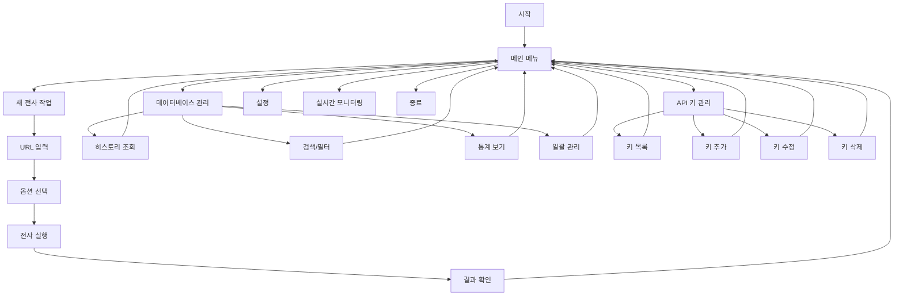

# TUI 아키텍처 설계

## 개요

Open-Scribe TUI는 Textual 프레임워크를 기반으로 하는 고도화된 터미널 사용자 인터페이스입니다. 복잡한 전사 작업과 데이터베이스 관리를 직관적이고 효율적으로 수행할 수 있도록 설계되었습니다.

## 아키텍처 구조

### 전체 시스템 아키텍처

```
┌─────────────────────────────────────────┐
│              TUI Layer                  │
│  ┌─────────────────────────────────────┐ │
│  │         Textual App                 │ │
│  │  ┌─────────────┐ ┌─────────────┐   │ │
│  │  │   Screens   │ │   Widgets   │   │ │
│  │  └─────────────┘ └─────────────┘   │ │
│  └─────────────────────────────────────┘ │
└─────────────────────────────────────────┘
┌─────────────────────────────────────────┐
│            Business Logic               │
│  ┌─────────────────────────────────────┐ │
│  │         Core Modules                │ │
│  │  ┌─────────┐ ┌─────────┐ ┌────────┐│ │
│  │  │Database │ │Transcrib│ │Config  ││ │
│  │  │Manager  │ │ers      │ │Manager ││ │
│  │  └─────────┘ └─────────┘ └────────┘│ │
│  └─────────────────────────────────────┘ │
└─────────────────────────────────────────┘
┌─────────────────────────────────────────┐
│            Data Layer                   │
│  ┌─────────┐ ┌─────────┐ ┌──────────┐  │
│  │SQLite DB│ │.env File│ │File System│  │
│  └─────────┘ └─────────┘ └──────────┘  │
└─────────────────────────────────────────┘
```

### 디렉토리 구조

```
src/tui/
├── __init__.py                    # TUI 패키지 초기화
├── app.py                         # 메인 Textual 애플리케이션
│
├── screens/                       # 화면 컴포넌트
│   ├── __init__.py
│   ├── base.py                   # 기본 화면 클래스
│   ├── main_menu.py              # 메인 메뉴 (홈 화면)
│   ├── transcribe.py             # 전사 작업 화면
│   ├── database.py               # 데이터베이스 관리 화면
│   ├── api_keys.py               # API 키 관리 화면
│   ├── settings.py               # 설정 관리 화면
│   └── monitor.py                # 실시간 모니터링 화면
│
├── widgets/                       # 재사용 가능한 위젯
│   ├── __init__.py
│   ├── tables.py                 # 테이블 디스플레이 위젯
│   ├── forms.py                  # 폼 입력 위젯
│   ├── progress.py               # 진행률 표시 위젯
│   ├── logs.py                   # 로그 뷰어 위젯
│   ├── charts.py                 # 통계 차트 위젯
│   └── dialogs.py                # 모달 다이얼로그 위젯
│
├── utils/                         # TUI 유틸리티
│   ├── __init__.py
│   ├── config_manager.py         # 설정 파일 관리
│   ├── db_manager.py             # 데이터베이스 작업
│   ├── validators.py             # 입력 검증
│   ├── formatters.py             # 데이터 포맷팅
│   └── keybindings.py            # 키보드 바인딩
│
└── themes/                        # 테마 관리
    ├── __init__.py
    ├── dark.tcss                 # 다크 테마
    ├── light.tcss                # 라이트 테마
    └── custom.tcss               # 커스텀 테마
```

## 화면 플로우

### 메인 플로우 다이어그램



### 화면 상호작용

```
┌─────────────────────────────────────────┐
│               메인 메뉴                  │
│  [1] 🎬 새 전사 작업                    │
│  [2] 📊 데이터베이스 관리               │
│  [3] 🔑 API 키 관리                     │
│  [4] ⚙️  설정                           │
│  [5] 📈 실시간 모니터링                 │
│  [Q] 종료                               │
└─────────────────────────────────────────┘
               │
               ▼
┌─────────────────────────────────────────┐
│            전사 작업 화면                │
│ ┌─────────────────────────────────────┐ │
│ │ URL 입력                            │ │
│ │ [https://youtube.com/...          ] │ │
│ └─────────────────────────────────────┘ │
│ ┌─────────────────────────────────────┐ │
│ │ 엔진 선택                           │ │
│ │ ○ GPT-4o-transcribe                 │ │
│ │ ● GPT-4o-mini-transcribe (기본)     │ │
│ │ ○ Whisper API                       │ │
│ │ ○ YouTube Transcript API            │ │
│ └─────────────────────────────────────┘ │
│ ┌─────────────────────────────────────┐ │
│ │ 옵션                                │ │
│ │ ☑ 요약 생성    ☐ 번역              │ │
│ │ ☐ SRT 생성    ☐ 비디오 다운로드    │ │
│ │ ☑ 타임스탬프   ☐ 오디오 보관       │ │
│ └─────────────────────────────────────┘ │
│ ┌─────────────────────────────────────┐ │
│ │ [시작] [취소]                       │ │
│ └─────────────────────────────────────┘ │
└─────────────────────────────────────────┘
```

## 컴포넌트 아키텍처

### 메인 애플리케이션 클래스

```python
class OpenScribeTUI(App):
    """메인 TUI 애플리케이션"""
    
    # 바인딩
    BINDINGS = [
        ("ctrl+c", "quit", "종료"),
        ("f1", "help", "도움말"),
        ("f2", "theme", "테마 변경"),
        ("ctrl+r", "refresh", "새로고침"),
    ]
    
    # CSS 파일
    CSS_PATH = "themes/dark.tcss"
    
    def compose(self) -> ComposeResult:
        """UI 구성"""
        yield Header()
        yield MainMenu(id="main_menu")
        yield Footer()
    
    def on_mount(self) -> None:
        """앱 시작 시 초기화"""
        self.title = "Open-Scribe TUI v2.0"
        self.sub_title = "YouTube Transcription Tool"
```

### 화면 기본 클래스

```python
class BaseScreen(Screen):
    """모든 화면의 기본 클래스"""
    
    def __init__(self, *args, **kwargs):
        super().__init__(*args, **kwargs)
        self.db_manager = DatabaseManager()
        self.config_manager = ConfigManager()
    
    def on_key(self, event: events.Key) -> None:
        """키 이벤트 처리"""
        if event.key == "escape":
            self.app.pop_screen()
        elif event.key == "f5":
            self.refresh_data()
    
    def refresh_data(self) -> None:
        """데이터 새로고침 (하위 클래스에서 구현)"""
        pass
```

### 데이터 관리 계층

```python
class DatabaseManager:
    """데이터베이스 작업 관리"""
    
    def get_jobs_paginated(self, page: int, per_page: int) -> List[Dict]:
        """페이지별 작업 목록 조회"""
        pass
    
    def search_jobs(self, query: str, filters: Dict) -> List[Dict]:
        """작업 검색"""
        pass
    
    def get_statistics(self) -> Dict[str, Any]:
        """통계 데이터 조회"""
        pass

class ConfigManager:
    """설정 관리"""
    
    def load_env_vars(self) -> Dict[str, str]:
        """환경 변수 로드"""
        pass
    
    def save_env_vars(self, vars: Dict[str, str]) -> bool:
        """환경 변수 저장"""
        pass
    
    def validate_api_key(self, key: str) -> bool:
        """API 키 유효성 검증"""
        pass
```

## 데이터 플로우

### 전사 작업 플로우

```
사용자 입력 → 입력 검증 → 설정 준비 → 백그라운드 실행
     ↓              ↓           ↓           ↓
  URL/옵션      유효성 검사    엔진 선택    Worker Pool
     ↓              ↓           ↓           ↓
진행률 업데이트 ← 상태 추적 ← 실행 관리 ← 결과 처리
     ↓              ↓           ↓           ↓
  UI 렌더링     DB 업데이트   파일 저장   완료 알림
```

### 설정 관리 플로우

```
화면 로드 → 설정 읽기 → UI 표시 → 사용자 편집
    ↑           ↓          ↓          ↓
설정 저장 ← 유효성 검증 ← 입력 완료 ← 변경 사항
    ↓           ↓          ↓          ↓
.env 업데이트 → 앱 재시작 → 설정 적용 → 확인 메시지
```

## 확장성 고려사항

### 플러그인 아키텍처

```python
class PluginInterface:
    """플러그인 인터페이스"""
    
    def get_screen(self) -> Screen:
        """화면 컴포넌트 제공"""
        pass
    
    def get_menu_item(self) -> Dict[str, str]:
        """메뉴 항목 정보"""
        pass

class PluginManager:
    """플러그인 관리자"""
    
    def load_plugins(self, plugin_dir: Path) -> List[PluginInterface]:
        """플러그인 로드"""
        pass
    
    def register_plugin(self, plugin: PluginInterface) -> bool:
        """플러그인 등록"""
        pass
```

### 테마 시스템

```css
/* themes/dark.tcss */
Screen {
    background: #1e1e2e;
    color: #cdd6f4;
}

.menu-item {
    background: #313244;
    color: #f5f5f5;
    border: solid #89b4fa;
}

.menu-item:hover {
    background: #89b4fa;
    color: #1e1e2e;
}

.progress-bar {
    bar-color: #a6e3a1;
    bar-complete-color: #fab387;
}
```

## 성능 최적화

### 비동기 처리

- Textual의 `worker` 데코레이터를 사용한 백그라운드 작업
- 실시간 UI 업데이트를 위한 반응형 위젯
- 대용량 데이터 처리를 위한 가상화 테이블

### 메모리 관리

- 레이지 로딩을 통한 초기 로드 시간 단축
- 페이지네이션을 통한 메모리 사용량 제한
- 캐싱을 통한 반복 작업 최적화

## 보안 고려사항

### API 키 보안

- 메모리 내 키 마스킹
- 임시 파일 생성 시 권한 제한
- 로그에 민감 정보 포함 방지

### 데이터 보호

- SQLite 파일 접근 권한 관리
- 사용자 입력 데이터 검증
- XSS 방지를 위한 출력 이스케이핑