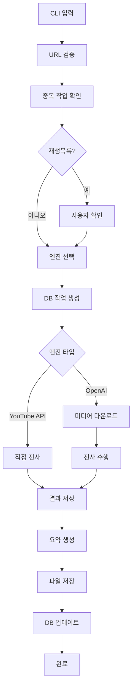
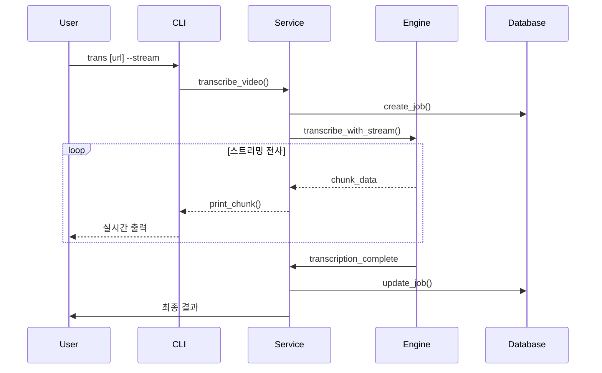

# 기술 설계서 (Technical Design Document)
## YouTube 영상 전사 도구

**문서 버전:** 1.0
**작성일:** 2024년
**작성자:** 개발팀

---

## 🏗️ System Architecture Overview

### 아키텍처 패턴
본 시스템은 **계층화 아키텍처(Layered Architecture)**를 채택하여 관심사 분리와 유지보수성을 높였습니다.

```
┌─────────────────┐
│   CLI Layer     │  ← 사용자 인터페이스
├─────────────────┤
│ Service Layer   │  ← 비즈니스 로직
├─────────────────┤
│  Engine Layer   │  ← 전사 엔진 추상화
├─────────────────┤
│  Data Layer     │  ← 데이터베이스 및 파일 관리
├─────────────────┤
│ External APIs   │  ← 외부 서비스 연동
└─────────────────┘
```

### 주요 설계 원칙
- **단일 책임 원칙 (SRP):** 각 컴포넌트는 하나의 책임만 가짐
- **개방-폐쇄 원칙 (OCP):** 확장에는 열려있고, 수정에는 닫혀있음
- **의존성 역전 원칙 (DIP):** 추상화에 의존하고 구체화에 의존하지 않음
- **인터페이스 분리 원칙 (ISP):** 클라이언트는 사용하지 않는 인터페이스에 의존하지 않음

---

## 🧩 Component Architecture

### 1. CLI Layer (Presentation Layer)

#### CLIController
```python
class CLIController:
    def __init__(self):
        self.argument_parser = ArgumentParser()
        self.option_validator = OptionValidator()
        self.user_interactor = UserInteractor()

    def parse_arguments(self, args: List[str]) -> ParsedArguments:
        """명령어 인수 파싱 및 검증"""

    def validate_options(self, args: ParsedArguments) -> ValidationResult:
        """옵션 조합 유효성 검증"""

    def handle_interactive_input(self, prompt: str) -> UserResponse:
        """사용자 상호작용 처리"""
```

#### OptionValidator
```python
class OptionValidator:
    def validate_engine_options(self, engine: str, options: dict) -> bool:
        """엔진별 옵션 검증"""

    def validate_file_paths(self, paths: dict) -> bool:
        """파일 경로 유효성 검증"""

    def check_dependencies(self, required_tools: List[str]) -> DependencyStatus:
        """필수 의존성 확인"""
```

### 2. Service Layer (Business Logic Layer)

#### TranscriptionService
```python
class TranscriptionService:
    def __init__(self, engine_factory: EngineFactory, db_manager: DBManager):
        self.engine_factory = engine_factory
        self.db_manager = db_manager
        self.file_manager = FileManager()

    async def transcribe_video(self, url: str, options: TranscriptionOptions) -> TranscriptionResult:
        """메인 전사 워크플로우 실행"""

    def _validate_url(self, url: str) -> URLValidationResult:
        """URL 유효성 검증"""

    def _check_duplicate_jobs(self, url: str, force: bool) -> JobCheckResult:
        """중복 작업 확인"""

    async def _download_media(self, url: str, media_type: str) -> DownloadResult:
        """미디어 파일 다운로드"""

    async def _perform_transcription(self, media_path: str, engine: str) -> TranscriptionResult:
        """전사 수행"""

    async def _generate_summary(self, transcription: str, verbose: bool) -> SummaryResult:
        """요약 생성"""
```

#### FileManager
```python
class FileManager:
    def __init__(self, base_path: str = "~/Documents/GitHub/yt-trans"):
        self.base_path = Path(base_path)

    def create_directories(self) -> None:
        """필요한 디렉토리 생성"""

    def save_transcription(self, content: str, filename: str, export_downloads: bool) -> FileSaveResult:
        """전사 결과 저장"""

    def save_srt(self, segments: List[Segment], filename: str) -> FileSaveResult:
        """SRT 자막 파일 저장"""

    def cleanup_temp_files(self, pattern: str) -> None:
        """임시 파일 정리"""
```

### 3. Engine Layer (Abstraction Layer)

#### EngineFactory
```python
class EngineFactory:
    @staticmethod
    def create_engine(engine_type: str, config: EngineConfig) -> BaseEngine:
        """엔진 타입에 따른 인스턴스 생성"""

    @staticmethod
    def get_engine_config(engine_type: str) -> EngineConfig:
        """엔진별 설정 반환"""
```

#### BaseEngine (Abstract Base Class)
```python
class BaseEngine(ABC):
    def __init__(self, config: EngineConfig):
        self.config = config
        self.client = self._initialize_client()

    @abstractmethod
    async def transcribe(self, media_path: str) -> TranscriptionResult:
        """전사 수행 (추상 메서드)"""

    @abstractmethod
    def is_available(self) -> bool:
        """엔진 사용 가능 여부 확인"""

    @abstractmethod
    def get_quality_level(self) -> str:
        """품질 레벨 반환"""

    def _initialize_client(self):
        """클라이언트 초기화"""
```

#### Concrete Engine Implementations
- **YouTubeTranscriptEngine:** youtube-transcript-api 사용
- **WhisperEngine:** OpenAI Whisper API 사용
- **GPT4oMiniEngine:** GPT-4o-mini 모델 사용
- **GPT4oEngine:** GPT-4o 모델 사용

### 4. Data Layer (Data Access Layer)

#### DBManager
```python
class DBManager:
    def __init__(self, db_path: str):
        self.db_path = db_path
        self.connection_pool = ConnectionPool()

    def create_job(self, job_data: JobData) -> int:
        """작업 생성"""

    def update_job_status(self, job_id: int, status: str, metadata: dict = None) -> bool:
        """작업 상태 업데이트"""

    def get_job(self, job_id: int) -> JobData:
        """작업 조회"""

    def check_duplicate_job(self, url: str, status_filter: List[str] = None) -> List[JobData]:
        """중복 작업 확인"""

    def cleanup_completed_jobs(self, days_old: int = 30) -> int:
        """완료된 작업 정리"""
```

#### JobRepository
```python
class JobRepository:
    def __init__(self, db_manager: DBManager):
        self.db_manager = db_manager

    def save(self, job: Job) -> Job:
        """작업 저장"""

    def find_by_url(self, url: str) -> Optional[Job]:
        """URL로 작업 검색"""

    def find_by_status(self, status: str) -> List[Job]:
        """상태별 작업 검색"""

    def update(self, job: Job) -> Job:
        """작업 업데이트"""
```

---

## 🗄️ Database Design

### 데이터베이스 스키마

#### transcription_jobs 테이블
```sql
CREATE TABLE transcription_jobs (
    id INTEGER PRIMARY KEY AUTOINCREMENT,
    request_url TEXT NOT NULL UNIQUE,
    title TEXT NOT NULL,
    engine TEXT NOT NULL,
    status TEXT NOT NULL DEFAULT 'pending',
    topic_category TEXT,
    keywords TEXT,  -- JSON format
    summary TEXT,
    created_at DATETIME DEFAULT CURRENT_TIMESTAMP,
    updated_at DATETIME DEFAULT CURRENT_TIMESTAMP,
    file_path TEXT,
    audio_path TEXT,
    video_path TEXT,
    srt_path TEXT,
    duration INTEGER,
    language TEXT,
    error_message TEXT,
    retry_count INTEGER DEFAULT 0,
    force_override BOOLEAN DEFAULT FALSE
);

-- 인덱스
CREATE INDEX idx_status ON transcription_jobs(status);
CREATE INDEX idx_url ON transcription_jobs(request_url);
CREATE INDEX idx_created_at ON transcription_jobs(created_at);
CREATE INDEX idx_engine ON transcription_jobs(engine);
```

### 데이터 모델

#### Job 엔티티
```python
@dataclass
class Job:
    id: Optional[int] = None
    request_url: str = ""
    title: str = ""
    engine: str = "gpt-4o-mini-transcribe"
    status: str = "pending"
    topic_category: Optional[str] = None
    keywords: Optional[List[str]] = None
    summary: Optional[str] = None
    created_at: Optional[datetime] = None
    updated_at: Optional[datetime] = None
    file_path: Optional[str] = None
    audio_path: Optional[str] = None
    video_path: Optional[str] = None
    srt_path: Optional[str] = None
    duration: Optional[int] = None
    language: Optional[str] = None
    error_message: Optional[str] = None
    retry_count: int = 0
    force_override: bool = False

    def is_completed(self) -> bool:
        return self.status == "completed"

    def is_failed(self) -> bool:
        return self.status == "failed"

    def can_retry(self) -> bool:
        return self.retry_count < 3 and self.status in ["failed", "cancelled"]
```

---

## 🔄 Data Flow Architecture

### 전사 워크플로우



### 스트리밍 전사 플로우



---

## 🔌 API Design

### 내부 API 인터페이스

#### Engine Interface
```python
class EngineInterface(Protocol):
    async def transcribe(self, media_path: str, stream_callback: Optional[Callable] = None) -> TranscriptionResult:
        """전사 수행"""

    def get_supported_formats(self) -> List[str]:
        """지원 포맷 목록"""

    def get_quality_level(self) -> str:
        """품질 레벨"""

    def validate_config(self) -> bool:
        """설정 검증"""

    async def health_check(self) -> bool:
        """상태 확인"""
```

#### FileManager Interface
```python
class FileManagerInterface(Protocol):
    def save_transcription(self, content: str, filename: str) -> str:
        """전사 결과 저장"""

    def save_srt(self, segments: List[dict], filename: str) -> str:
        """SRT 파일 저장"""

    def get_file_info(self, file_path: str) -> dict:
        """파일 정보 조회"""

    def cleanup_old_files(self, days: int) -> int:
        """오래된 파일 정리"""
```

### 외부 API 통합

#### OpenAI API 통합
```python
class OpenAIManager:
    def __init__(self, api_key: str):
        self.client = AsyncOpenAI(api_key=api_key)

    async def transcribe_audio(self, audio_path: str, model: str = "whisper-1") -> str:
        """오디오 전사"""

    async def generate_summary(self, text: str, prompt_template: str) -> str:
        """요약 생성"""

    async def translate_text(self, text: str, target_lang: str = "ko") -> str:
        """텍스트 번역"""
```

#### YouTube Transcript API 통합
```python
class YouTubeTranscriptManager:
    def __init__(self):
        self.transcript_list = []

    async def get_transcript(self, video_id: str, languages: List[str] = None) -> List[dict]:
        """자막 데이터 조회"""

    def extract_video_id(self, url: str) -> str:
        """URL에서 비디오 ID 추출"""

    def format_transcript(self, transcript_data: List[dict]) -> str:
        """자막 데이터 포맷팅"""
```

---

## 🔐 Security Architecture

### API 키 관리
```python
class SecretManager:
    def __init__(self, config_path: str = "~/.yt-trans/config.json"):
        self.config_path = Path(config_path)
        self._secrets = {}

    def set_api_key(self, service: str, key: str) -> None:
        """API 키 저장 (암호화)"""

    def get_api_key(self, service: str) -> str:
        """API 키 조회 (복호화)"""

    def validate_api_key(self, service: str, key: str) -> bool:
        """API 키 유효성 검증"""

    def rotate_api_key(self, service: str, new_key: str) -> None:
        """API 키 교체"""
```

### 파일 시스템 보안
```python
class FileSecurityManager:
    def __init__(self, base_path: str):
        self.base_path = Path(base_path)

    def validate_path(self, path: str) -> bool:
        """경로 검증 (디렉토리 트래버설 방지)"""

    def set_secure_permissions(self, file_path: str) -> None:
        """안전한 파일 권한 설정"""

    def sanitize_filename(self, filename: str) -> str:
        """파일명 정제 (특수문자 제거)"""

    def validate_file_size(self, file_path: str, max_size: int) -> bool:
        """파일 크기 검증"""
```

### 네트워크 보안
```python
class NetworkSecurityManager:
    def __init__(self):
        self.session = aiohttp.ClientSession()

    async def secure_request(self, url: str, **kwargs) -> aiohttp.ClientResponse:
        """보안 HTTP 요청"""

    def validate_ssl_certificate(self, response: aiohttp.ClientResponse) -> bool:
        """SSL 인증서 검증"""

    def handle_rate_limits(self, response: aiohttp.ClientResponse) -> None:
        """속도 제한 처리"""

    async def retry_with_backoff(self, func: Callable, max_retries: int = 3) -> Any:
        """지수 백오프 재시도"""
```

---

## 🚀 Deployment Architecture

### 로컬 배포 구조
```
~/Documents/GitHub/yt-trans/
├── main.py                 # CLI 진입점
├── yt_trans/
│   ├── __init__.py
│   ├── cli/
│   │   ├── __init__.py
│   │   ├── controller.py
│   │   └── validator.py
│   ├── services/
│   │   ├── __init__.py
│   │   ├── transcription.py
│   │   └── file_manager.py
│   ├── engines/
│   │   ├── __init__.py
│   │   ├── base.py
│   │   ├── youtube_engine.py
│   │   ├── whisper_engine.py
│   │   ├── gpt4o_mini_engine.py
│   │   └── gpt4o_engine.py
│   ├── data/
│   │   ├── __init__.py
│   │   ├── models.py
│   │   └── repository.py
│   └── utils/
│       ├── __init__.py
│       ├── config.py
│       └── helpers.py
├── audio/                  # 오디오 파일
├── transcript/             # 전사 결과
├── temp_audio/            # 임시 파일
├── yt_trans.db            # SQLite 데이터베이스
└── requirements.txt       # 의존성
```

### 패키지 구조
```python
# yt_trans/__init__.py
__version__ = "1.0.0"

# yt_trans/cli/__init__.py
from .controller import CLIController

# yt_trans/services/__init__.py
from .transcription import TranscriptionService
from .file_manager import FileManager

# yt_trans/engines/__init__.py
from .factory import EngineFactory
from .youtube_engine import YouTubeTranscriptEngine
from .whisper_engine import WhisperEngine
from .gpt4o_mini_engine import GPT4oMiniEngine
from .gpt4o_engine import GPT4oEngine

# yt_trans/data/__init__.py
from .models import Job
from .repository import JobRepository

# yt_trans/utils/__init__.py
from .config import Config
from .helpers import *
```

### 설정 관리
```python
# config.py
@dataclass
class Config:
    # 경로 설정
    base_path: str = "~/Documents/GitHub/yt-trans"
    audio_path: str = "{base_path}/audio"
    transcript_path: str = "{base_path}/transcript"
    temp_path: str = "{base_path}/temp_audio"

    # API 설정
    openai_api_key: Optional[str] = None
    default_engine: str = "gpt-4o-mini-transcribe"
    stream_enabled: bool = True

    # 파일 설정
    export_downloads: bool = True
    max_file_size: int = 2 * 1024 * 1024 * 1024  # 2GB

    # 데이터베이스 설정
    db_path: str = "{base_path}/yt_trans.db"
    cleanup_days: int = 30

    # 재시도 설정
    max_retries: int = 3
    retry_delay: int = 1
```

---

## 🛠️ Technology Stack

### Core Technologies
- **Python 3.8+:** 메인 프로그래밍 언어
- **FastAPI:** CLI 애플리케이션 프레임워크
- **SQLite:** 로컬 데이터베이스
- **aiohttp:** 비동기 HTTP 클라이언트

### External Dependencies
- **yt-dlp:** 미디어 다운로드
- **openai:** AI 서비스 통합
- **youtube-transcript-api:** YouTube 자막 API
- **pydantic:** 데이터 검증
- **click:** 명령어 인터페이스
- **rich:** 터미널 UI 개선

### Development Tools
- **pytest:** 단위 테스트
- **black:** 코드 포맷터
- **mypy:** 타입 체커
- **pre-commit:** 코드 품질 관리
- **uv:** 패키지 관리

### Infrastructure
- **GitHub Actions:** CI/CD 파이프라인
- **Docker:** 컨테이너화 (선택적)
- **pre-commit hooks:** 코드 품질 자동화
- **Makefile:** 빌드 자동화

---

*이 설계서는 개발 진행 중 지속적으로 업데이트되며, 실제 구현 시 변경될 수 있습니다.*
